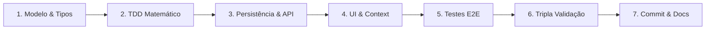

# 🚀 Skill: Full-Stack Task Orchestration no FinPlan

Esta skill é o guia operacional mestre para o desenvolvimento de qualquer tarefa ponta a ponta (nova funcionalidade, refatoração de regras ou correção de bugs) no repositório **FinPlan**.

---

## 1. Fluxo de Trabalho em 7 Etapas



---

## 2. Passo a Passo Detalhado com Arquivos Reais

### Etapa 1: Análise de Requisitos e Modelagem do Domínio
1. Verifique se a mudança afeta as entidades centrais em [`src/types/budget.ts`](file:///home/gildo-duarte/Documentos/Projects/fin-plan/src/types/budget.ts) (`MonthItem`, `BudgetItem`, `OneTimeCost`, `SimulationSettings`, `FinancialGoal`, `BudgetState`).
2. Se novos campos forem introduzidos, adicione os valores padrão correspondentes em [`src/constants/seedData.ts`](file:///home/gildo-duarte/Documentos/Projects/fin-plan/src/constants/seedData.ts).
3. **Migração de Esquemas Obrigatória**:
   - Atualize a função [`migrateState`](file:///home/gildo-duarte/Documentos/Projects/fin-plan/src/services/storageService.ts) para garantir que dados legados armazenados no `localStorage` ou no MongoDB não quebrem ao carregar campos ausentes:
   ```typescript
   // Exemplo de fallback defensivo em src/services/storageService.ts:
   return {
     ...INITIAL_BUDGET_STATE,
     version: 5,
     // Preenchimento garantido de campos novos ou listas ausentes
     lists: {
       cartoes: Array.isArray(data.lists?.cartoes) ? data.lists.cartoes : [],
       fixas: Array.isArray(data.lists?.fixas) ? data.lists.fixas : [],
       vars: Array.isArray(data.lists?.vars) ? data.lists.vars : [],
     },
   };
   ```

### Etapa 2: Motor Matemático Puro com TDD (Red-Green-Refactor)
1. **Nunca misture cálculos financeiros com React**. Todas as regras devem ser funções puras.
2. Escreva o caso de teste primeiro em [`src/__tests__/budgetCalculator.test.ts`](file:///home/gildo-duarte/Documentos/Projects/fin-plan/src/__tests__/budgetCalculator.test.ts).
3. Implemente a regra em [`src/services/budgetCalculator.ts`](file:///home/gildo-duarte/Documentos/Projects/fin-plan/src/services/budgetCalculator.ts).
4. Execute `npm test` e confirme a aprovação antes de passar para a interface.

### Etapa 3: Persistência & Camada de API
1. Se a alteração envolver novo método ou validação no backend, altere [`api/budget.ts`](file:///home/gildo-duarte/Documentos/Projects/fin-plan/api/budget.ts).
2. Atualize o cliente HTTP [`src/services/budgetApiService.ts`](file:///home/gildo-duarte/Documentos/Projects/fin-plan/src/services/budgetApiService.ts) e os testes de rede mockados em [`src/__tests__/budgetApiService.test.ts`](file:///home/gildo-duarte/Documentos/Projects/fin-plan/src/__tests__/budgetApiService.test.ts).
3. Mantenha o payload do `POST /api/budget` atômico e idempotente.

### Etapa 4: Integração de UI e Contexto React
1. Adicione a ação e despachos correspondentes no [`src/context/BudgetContext.tsx`](file:///home/gildo-duarte/Documentos/Projects/fin-plan/src/context/BudgetContext.tsx), respeitando a imutabilidade do React.
2. Construa ou adapte componentes visuais em [`src/components/`](file:///home/gildo-duarte/Documentos/Projects/fin-plan/src/components/):
   - Para valores em dinheiro, utilize sempre [`CurrencyInput`](file:///home/gildo-duarte/Documentos/Projects/fin-plan/src/components/ui/CurrencyInput.tsx).
   - Para listas expansíveis, utilize [`CollapsibleSection`](file:///home/gildo-duarte/Documentos/Projects/fin-plan/src/components/ui/CollapsibleSection.tsx).
   - Use `font-mono tabular-nums` para alinhamento numérico perfeito.
   - Aplique classes Tailwind compatíveis com Light Mode e Dark Mode (`dark:...`).
   - Forneça feedback de sucesso ou erro com `useToast()` de [`ToastContext.tsx`](file:///home/gildo-duarte/Documentos/Projects/fin-plan/src/context/ToastContext.tsx).

### Etapa 5: Testes End-to-End (E2E)
1. Para fluxos de usuário críticos (navegação entre abas, expansão de listas, adição de registros), adicione cenários em [`e2e/budget-flow.spec.ts`](file:///home/gildo-duarte/Documentos/Projects/fin-plan/e2e/budget-flow.spec.ts).
2. Mantenha os testes E2E herméticos utilizando `page.route('/api/budget', ...)` para interceptar requisições à API.

### Etapa 6: Validação Tripla Obrigatória
Execute localmente os três passos de controle de qualidade:
```bash
npm test          # Suíte de testes unitários (Vitest)
npm run build     # Typecheck tsc + bundling Vite
npm run test:e2e  # Testes Playwright
```

### Etapa 7: Commit e Atualização Documental
1. Verifique se alguma decisão arquitetural ou endpoint mudou. Atualize [`docs/ARCHITECTURE.md`](file:///home/gildo-duarte/Documentos/Projects/fin-plan/docs/ARCHITECTURE.md) ou [`docs/API.md`](file:///home/gildo-duarte/Documentos/Projects/fin-plan/docs/API.md) se aplicável.
2. Submeta os arquivos seguindo os padrões do [`.agents/skills/git-workflow.md`](file:///home/gildo-duarte/Documentos/Projects/fin-plan/.agents/skills/git-workflow.md):
   ```bash
   git add <arquivos>
   git commit -m "feat(<escopo>): <descrição da entrega>"
   ```
