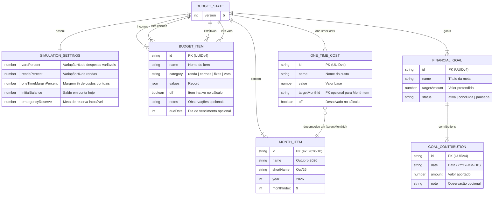

# 🏛️ FinPlan — Arquitetura do Sistema (Monorepo)

Este documento detalha o funcionamento interno, as decisões de engenharia e os padrões arquiteturais do **FinPlan**, uma aplicação de planejamento financeiro pessoal de alta precisão baseada em uma arquitetura **Local-First reativa com persistência atômica no MongoDB Atlas via Backend Go Containerizado**.

O repositório é estruturado como um **Monorepo** com deploys independentes entre o frontend web SPA e a API REST em Go.

---

## 1. Visão Geral da Arquitetura

O FinPlan adota o paradigma **Reativo em Memória com Persistência Direta no Banco**: toda interação do usuário é refletida instantaneamente no estado local em memória com 0ms de latência percebida, enquanto um motor matemático puro calcula projeções de fluxo de caixa e sensibilidade em tempo real; em segundo plano, um timer de debounce de **500ms** consolida e envia o estado completo da aplicação de forma atômica para um documento único no **MongoDB Atlas** através do backend Go (`/api/v1/budget`), garantindo integridade, consistência e sincronização centralizada.

---

## 2. Diagrama de Fluxo e Persistência

O fluxo de dados da aplicação abrange duas camadas essenciais: interação reativa no navegador e persistência assíncrona com nuvem:

```mermaid
flowchart TD
    subgraph Browser["Cliente Web SPA (apps/web)"]
        User(["Usuário"]) -->|Edita valor / Adiciona item / Move slider| UI["Componentes React (Views & Modals)"]
        UI -->|Dispara Action| Context["BudgetContext (React Context & Hooks)"]
        
        Context -->|1. Atualização Instantânea (0ms)| LocalState["Estado em Memória (React State)"]
        
        LocalState -->|2. Recálculo Puro (0ms)| MathEngine["budgetCalculator.ts (calculateBudget)"]
        MathEngine -->|3. Projeções e Métricas Atualizadas| UI
        
        Context -->|4. Timer de Debounce (500ms)| SyncQueue{"Debounce 500ms"}
    end

    subgraph BackendAPI["Backend REST Go (apps/api)"]
        SyncQueue -->|5. POST /api/v1/budget (JSON State + x-api-key)| GoServer["cmd/api/main.go (HTTP Mux)"]
        GoServer -->|6. Middleware CORS + Auth| AuthCheck{"Validação de Acesso (API_SECRET_KEY)"}
        AuthCheck -->|7. Repository com timeout 8s| MongoDriver["Driver Oficial MongoDB Go (v1.17.1)"]
    end

    subgraph CloudDatabase["Persistência em Nuvem"]
        MongoDriver -->|8. Upsert Atômico (_id: default_budget)| AtlasDB[("MongoDB Atlas: database 'finplan', collection 'budgets'")]
    end

    %% Fluxo de Inicialização
    Browser -.->|GET /api/v1/budget no carregamento inicial| GoServer
    AtlasDB -.->|Retorna estado persistido| GoServer
    GoServer -.->|Hydrate do estado remoto| Context
```

### Ciclo de Vida da Persistência:
1. **Carga Inicial e Proteção contra Sobrescrita**: Na inicialização, a aplicação busca os dados mais recentes do MongoDB Atlas via `GET /api/v1/budget`. O salvamento automático permanece **estritamente bloqueado** (`isLoadedRef = false`) até que a resposta do banco seja recebida com sucesso.
2. **Resiliência a Cold-Start**: Devido à infraestrutura gratuita com hibernação do container, o cliente HTTP utiliza timeout estendido (45s) e retentativas automáticas com backoff para erros transitórios (502/503/504). Caso a conexão falhe, o salvamento automático continua bloqueado e uma mensagem clara é apresentada com opção de reconexão manual, protegendo integralmente os dados pré-existentes no MongoDB contra dados zerados.
3. **Hidratação Transparente**: Ao receber os dados remotos, o estado React é hidratado sem acionar o timer de salvamento em nuvem.
4. **Edição**: Apenas alterações reais desencadeadas pelo usuário agendam a execução de `budgetApiService.saveBudget` via debounce de 500ms. Edições sucessivas durante esse intervalo cancelam o timer anterior (`clearTimeout`), consolidando apenas a versão final em um único `POST /api/v1/budget`.
5. **Cálculo Puro**: O hook `useBudgetCalculations` reexecuta `calculateBudget` gerando `monthlySummaries` e `metrics` instantaneamente (0ms de latência percebida).

---

## 3. Decisões Arquiteturais Relevantes

### 3.1. Estado Reativo Otimista vs. Bloqueio por Rede
- **Decisão**: A interface não aguarda respostas do servidor HTTP para renderizar novos valores ou confirmar inserções.
- **Por quê**: Em ferramentas de planejamento financeiro pessoal, o usuário realiza dezenas de edições por minuto ao balancear despesas e simular cenários. O atraso de requisições de rede (100ms a 500ms por clique) inviabilizaria a sensação de controle fluido. O estado em memória garante resposta instantânea (0ms), enquanto o debounce envia a versão consolidada ao MongoDB Atlas.

### 3.2. Backend Go Containerizado vs. Funções Serverless
- **Decisão**: API REST centralizada e conteinerizada em Go (`apps/api/`), substituindo totalmente funções serverless legadas.
- **Por quê**:
  - **Eficiência e Cold-Starts Nulos**: Go compila para um binário estático único sem dependências de runtime, iniciando em milissegundos e eliminando cold-starts frequentes em provedores serverless.
  - **Deploy Desacoplado**: O backend pode ser implantado em qualquer nuvem ou plataforma de containers (Google Cloud Run, AWS ECS, Fly.io, Railway, Kubernetes ou VPS) independentemente do provedor de hospedagem do frontend.
  - **Segurança da Imagem**: A imagem de produção utiliza `gcr.io/distroless/static:nonroot`, pesando cerca de 20 MB e sem shell ou utilitários desnecessários, minimizando a superfície de vulnerabilidade.
  - **Multi-Client Ready**: Prepara a arquitetura para atender tanto a aplicação Web SPA quanto o futuro aplicativo mobile Android sem acoplamento à infraestrutura Vercel.

### 3.3. Documento Único Atômico (`default_budget`) vs. Coleções Normalizadas
- **Decisão**: O estado financeiro completo (`BudgetState`) é persistido como um único documento BSON na coleção `budgets` (`_id: 'default_budget'`).
- **Por quê**:
  - Evita problemas de integridade relacional ou transações atômicas multi-documento (`session.withTransaction`) complexas no MongoDB.
  - Ao atualizar uma despesa ou reordenar meses, todo o orçamento é gravado de forma idempotente em uma única operação de `updateOne({ _id: 'default_budget' }, { $set: { data: body, updatedAt } }, { upsert: true })`.
  - O volume total de dados de um orçamento anual ou bienal é inferior a 100 KB, muito abaixo do limite rígido de 16 MB por documento no MongoDB.

### 3.4. Identificadores Únicos Universais (UUIDv4) vs. Slugs Determinísticos Legados
- **Decisão**: Toda entidade (`BudgetItem`, `OneTimeCost`, `FinancialGoal`, `GoalContribution`) possui um identificador único UUIDv4 gerado na criação via `generateId()` (`crypto.randomUUID()`).
- **Por quê**: Em versões legadas baseadas em planilhas, utilizavam-se chaves compostas como `despesa:aluguel`. Esse padrão gerava bugs quando o usuário renomeava uma categoria ou criava dois itens com o mesmo nome. O UUID desacopla o ciclo de vida e chaves de dados do nome visual.

### 3.5. Monorepo Poliglota Desacoplado com Docker Compose
- **Decisão**: Estrutura monorepo organizada sob `apps/` com `apps/web` e `apps/api`, sem dependências ou `package.json` na raiz, orquestrada via Docker Compose.
- **Por quê**: Mantém o repositório agnóstico a linguagens na raiz, elimina `node_modules` órfãos, permite que frontend e backend tenham seus próprios ciclos de vida e empacotamento, e possibilita subir a stack completa com `docker compose up --build`.

---

## 4. Estrutura de Módulos e Responsabilidades

```text
fin-plan/
├── docker-compose.yml           # Orquestração local da API Go (apps/api)
├── .env.example                 # Exemplo documentado de variáveis
├── .gitignore                   # Regras de exclusão Git
├── README.md                    # Documentação principal
│
├── apps/
│   ├── web/                     # 📦 Aplicação Frontend React SPA
│   │   ├── vercel.json          # Configuração SPA estática para Vercel
│   │   ├── vite.config.ts       # Vite com proxy /api -> http://localhost:8080
│   │   ├── src/
│   │   │   ├── types/           # Interfaces do domínio financeiro (budget.ts)
│   │   │   ├── constants/       # Metadados de categorias, seed data e enums
│   │   │   ├── context/         # BudgetContext (estado global, debounce, sync) e ToastContext
│   │   │   ├── services/        # budgetCalculator.ts, budgetApiService.ts, storageService.ts
│   │   │   ├── hooks/           # useBudgetCalculations (memoização de métricas)
│   │   │   ├── utils/           # formatters.ts, idGenerator.ts
│   │   │   └── components/      # layout/, budget/, dashboard/, simulation/, goals/, modals/, ui/
│   │   └── e2e/                 # Testes de integração Playwright
│   │
│   └── api/                     # 📦 API REST Go
│       ├── Dockerfile           # Imagem Distroless estática
│       ├── cmd/api/main.go      # Entrypoint enxuto (signal.NotifyContext + app.Run)
│       └── internal/
│           ├── app/             # Application lifecycle, composição e shutdown gracioso
│           ├── budget/          # Handler HTTP, Service (business rules), Repository e Models Go
│           ├── config/          # Carregamento de variáveis de ambiente
│           └── middleware/      # Middlewares de Auth e CORS
│
└── docs/                        # Documentação Técnica
    ├── ARCHITECTURE.md          # Este documento
    └── API.md                   # Especificação dos endpoints /api/v1/*
```

---

## 5. Modelo de Dados

O modelo de dados é centralizado em `apps/web/src/types/budget.ts` e espelhado nas structs Go em `apps/api/internal/budget/model.go`.

### Diagrama Entidade-Relacionamento (Conceitual)



---

## 6. Autenticação e Segurança

O FinPlan foi projetado primordialmente para uso pessoal single-tenant. O fluxo de segurança é composto por:

1. **Autenticação por API Key Estática**:
   - Se a variável de ambiente `API_SECRET_KEY` for configurada no servidor Go, o middleware em `apps/api/internal/middleware/auth.go` bloqueia qualquer requisição não autorizada com status `401 Unauthorized`.
   - O cliente HTTP no frontend envia o valor de `VITE_API_SECRET_KEY` no cabeçalho HTTP `x-api-key` ou `Authorization: Bearer <token>`.
   - Caso `API_SECRET_KEY` não seja preenchida no servidor, o endpoint opera em modo aberto (conveniente para desenvolvimento local simplificado).
2. **CORS Restrito**:
   - O middleware de CORS em `apps/api/internal/middleware/cors.go` define cabeçalhos de controle de acesso (`Access-Control-Allow-Origin: *`, métodos `GET,OPTIONS,POST`).
3. **Ausência de Multi-Tenancy**:
   - **Nota Explícita**: O sistema **não** possui cadastro de senhas, JWT ou sessões multi-usuário. Todos os dados referem-se a uma única entidade orçamentária (`default_budget`).

---

## 7. Pontos de Extensão e Limitações Conhecidas

### Limitações Conhecidas Atuais:
1. **Concorrência Simples (Last-Write-Wins)**:
   - Se a aplicação for aberta em dois navegadores simultâneos e ambos salvarem edições, o último salvamento sobrescreverá o documento remoto por completo.
2. **Modelo Single-Tenant**:
   - Não há isolamento de múltiplos orçamentos por usuário no mesmo banco de dados. Para multi-tenant, o repositório em `repository.go` pode ser estendido recebendo um `userId`.
3. **Limite BSON de 16 MB**:
   - O armazenamento de todo o estado em um único documento no MongoDB é restrito a 16 MB. Para horizontes de 5 anos, o arquivo ocupa ~50 KB (< 0,4% do limite).

### Pontos de Extensão Futuros:
- **Multi-Tenant**: Adição de autenticação de usuários particionando a coleção `budgets` por identificador de usuário.
- **Aplicativo Mobile (Android/Kotlin ou React Native)**: Consumo direto dos endpoints `/api/v1/budget` já padronizados no backend Go.
- **Importação Bancária Automática**: Integração via Open Finance / Pluggy para sincronizar saldos reais e faturas de cartão.
