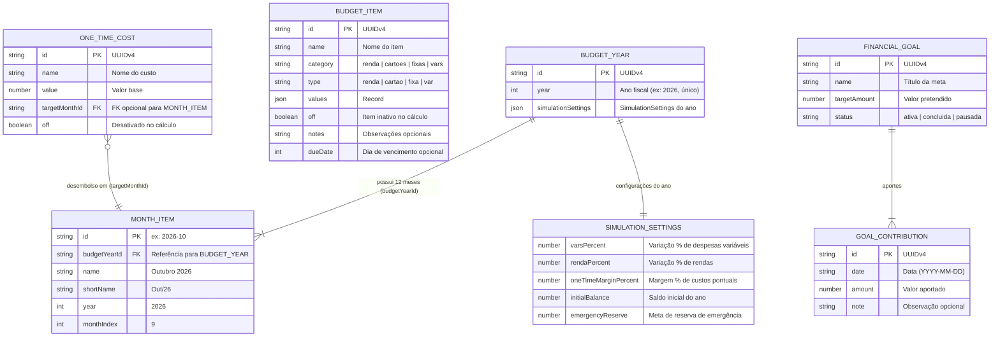

# 🏛️ FinPlan — Arquitetura do Sistema (Monorepo)

Este documento detalha o funcionamento interno, as decisões de engenharia e os padrões arquiteturais do **FinPlan**, uma aplicação de planejamento financeiro pessoal de alta precisão baseada em uma arquitetura **Local-First reativa com persistência atômica no MongoDB Atlas via Backend Go Containerizado**.

O repositório é estruturado como um **Monorepo** com deploys independentes entre o frontend web SPA e a API REST em Go.

---

## 1. Visão Geral da Arquitetura

O FinPlan adota o paradigma **Reativo em Memória com Persistência Atômica no Banco**: toda interação do usuário é refletida instantaneamente no estado local em memória com 0ms de latência percebida, enquanto um motor matemático puro calcula projeções de fluxo de caixa e sensibilidade em tempo real. As alterações são sincronizadas com granularidade atômica: operações discretas (criação/remoção de itens, custos, metas ou aportes) persistem imediatamente via REST (`POST`/`DELETE`/`PATCH`), enquanto a digitação contínua de valores monetários utiliza um timer de debounce de **400ms por item**, enviando apenas a modificação pontual ao **MongoDB Atlas** através do backend Go (`/api/v1/*`).

---

## 2. Diagrama de Fluxo e Persistência

O fluxo de dados da aplicação abrange duas camadas essenciais: interação reativa no navegador e persistência assíncrona com nuvem:

```mermaid
flowchart TD
    subgraph Browser["Cliente Web SPA (apps/web)"]
        User(["Usuário"]) -->|Edita valor de item / Adiciona meta / Move slider| UI["Componentes React (Views & Modals)"]
        UI -->|Dispara Action| Context["BudgetContext (React Context & Hooks)"]
        
        Context -->|1. Atualização Instantânea (0ms)| LocalState["Estado em Memória (React State)"]
        
        LocalState -->|2. Recálculo Puro (0ms)| MathEngine["budgetCalculator.ts (calculateBudget)"]
        MathEngine -->|3. Projeções e Métricas Atualizadas| UI
        
        Context -->|4. Edição de Valor: Debounce 400ms / Ações Discretas: Imediato| SyncQueue["Chamadas HTTP Atômicas"]
    end

    subgraph BackendAPI["Backend REST Go (apps/api)"]
        SyncQueue -->|5. PATCH/POST/DELETE /api/v1/* (x-api-key)| GoServer["cmd/api/main.go (HTTP Mux)"]
        GoServer -->|6. Middleware CORS + Auth| AuthCheck{"Validação de Acesso (API_SECRET_KEY)"}
        AuthCheck -->|7. Services e Repositórios Granulares| MongoDriver["Driver Oficial MongoDB Go"]
    end

    subgraph CloudDatabase["Persistência em Nuvem (Coleções Normalizadas)"]
        MongoDriver -->|8. Escrita Atômica por Entidade| AtlasDB[("MongoDB Atlas: budget_years, months, budget_items, one_time_costs, goals")]
    end

    %% Fluxo de Inicialização
    Browser -.->|GET /api/v1/budget-years/{year} no carregamento| GoServer
    AtlasDB -.->|Join server-side gerando YearViewModel| GoServer
    GoServer -.->|Hydrate do estado agregado| Context
```

### Ciclo de Vida da Persistência:
1. **Carga Inicial Agregada**: Na inicialização, a aplicação busca os dados consolidados do ano fiscal via `GET /api/v1/budget-years/{year}`, que monta uma visão completa (`YearViewModel`) em uma única viagem de rede. O salvamento permanece protegido (`isLoadedRef = false`) até a conclusão do carregamento.
2. **Resiliência e Reconexão**: O cliente HTTP utiliza timeout estendido e retentativas automáticas para lidar com cold-starts em planos gratuitos ou oscilações de conexão.
3. **Escrita Atômica**: Cada alteração (novo item, exclusão de custo pontual, aporte em meta) atua de forma atômica no banco (`/api/v1/budget-items`, `/api/v1/goals/{id}/contributions`, etc.), prevenindo concorrência destrutiva entre registros distintos.
4. **Cálculo Puro em Memória**: O hook `useBudgetCalculations` reexecuta `calculateBudget` gerando `monthlySummaries` e `metrics` instantaneamente (0ms de latência percebida).

---

## 3. Decisões Arquiteturais Relevantes

### 3.1. Estado Reativo Otimista vs. Bloqueio por Rede
- **Decisão**: A interface não aguarda respostas do servidor HTTP para renderizar novos valores ou confirmar inserções.
- **Por quê**: Em ferramentas de planejamento financeiro pessoal, o usuário realiza dezenas de edições por minuto ao balancear despesas e simular cenários. O atraso de requisições de rede (100ms a 500ms por clique) inviabilizaria a sensação de controle fluido. O estado em memória garante resposta instantânea (0ms), enquanto o debounce envia a versão consolidada ao MongoDB Atlas.

### 3.2. Backend Go Containerizado vs. Funções Serverless
- **Decisão**: API REST centralizada e conteinerizada em Go (`apps/api/`), substituindo totalmente funções serverless legadas.
- **Por quê**:
  - **Eficiência e Cold-Starts Nulos**: Go compila para um binário estático único sem dependências de runtime, iniciando em milissegundos e eliminando cold-starts frequentes em provedores serverless.
  - **Deploy Desacoplado**: O backend pode ser implantado em qualquer nuvem ou plataforma de containers (Google Cloud Run, AWS ECS, Fly.io, Railway, Kubernetes ou VPS) independentemente do provedor de hospedagem do frontend.
  - **Segurança da Imagem**: A imagem de produção utiliza `gcr.io/distroless/static:nonroot`, pesando cerca de 20 MB e sem shell ou utilitários desnecessários, minimizando a superfície de vulnerabilidade.
  - **Multi-Client Ready**: Prepara a arquitetura para atender tanto a aplicação Web SPA quanto o futuro aplicativo mobile Android sem acoplamento à infraestrutura Vercel.

### 3.3. Domínio Normalizado por Entidade & Agregação por Ano (`BudgetYear`) com Edição Atômica
- **Decisão**: O domínio foi reestruturado de um documento único para entidades normalizadas em coleções dedicadas (`budget_years`, `months`, `budget_items`, `one_time_costs`, `goals`), com agregação por ano fiscal (`GET /api/v1/budget-years/{year}`) e escrita atômica por item (`PATCH /api/v1/budget-items/{id}`).
- **Por quê**:
  - **Edição Atômica**: Alterar o valor de uma despesa num único mês não exige reescrever o orçamento inteiro, reduzindo tráfego e latência.
  - **Resolução de Concorrência**: O problema de last-write-wins deixa de afetar todo o orçamento e limita-se ao item específico alterado.
  - **Premissas com Escopo por Ano**: As configurações de simulação (`SimulationSettings`) passam a ter escopo por ano fiscal (`BudgetYear`), refletindo mudanças econômicas anuais realistas.
  - **Itens Trans-anuais**: `BudgetItem` não fica aprisionado a um ano específico (`values: map[monthId]float64`), permitindo continuidade de despesas e receitas entre múltiplos anos sem duplicidade cadastral.
  - **Leitura Agregada Eficiente**: O backend provê join server-side em Go para alimentar o frontend em apenas 1 requisição HTTP inicial (`GET /api/v1/budget-years/{year}`).

### 3.4. Identificadores Únicos Universais (UUIDv4) vs. Slugs Determinísticos Legados
- **Decisão**: Toda entidade (`BudgetItem`, `OneTimeCost`, `Goal`, `GoalContribution`) possui um identificador único UUIDv4 gerado na criação via `generateId()` (`crypto.randomUUID()` no frontend ou `httputil.GenerateUUID()` em Go).
- **Por quê**: Em versões legadas baseadas em planilhas, utilizavam-se chaves compostas como `despesa:aluguel`. Esse padrão gerava bugs quando o usuário renomeava uma categoria ou criava dois itens com o mesmo nome. O UUID desacopla o ciclo de vida e chaves de dados do nome visual.

### 3.5. Monorepo Poliglota Desacoplado com Docker Compose
- **Decisão**: Estrutura monorepo organizada sob `apps/` com `apps/web` e `apps/api`, sem dependências ou `package.json` na raiz, orquestrada via Docker Compose.
- **Por quê**: Mantém o repositório agnóstico a linguagens na raiz, elimina `node_modules` órfãos, permite que frontend e backend tenham seus próprios ciclos de vida e empacotamento, e possibilita subir a stack completa com `docker compose up --build`.

---

## 4. Estrutura de Módulos e Responsabilidades

```text
fin-plan/
├── docker-compose.yml           # Orquestração local da API Go (apps/api)
├── .env.example                 # Exemplo documentado de variáveis
├── .gitignore                   # Regras de exclusão Git
├── README.md                    # Documentação principal
│
├── apps/
│   ├── web/                     # 📦 Aplicação Frontend React SPA
│   │   ├── vercel.json          # Configuração SPA estática para Vercel
│   │   ├── vite.config.ts       # Vite com proxy /api -> http://localhost:8080
│   │   ├── src/
│   │   │   ├── types/           # Interfaces do domínio financeiro (budget.ts)
│   │   │   ├── constants/       # Metadados de categorias, seed data e enums
│   │   │   ├── context/         # BudgetContext (estado global, debounce, sync) e ToastContext
│   │   │   ├── services/        # budgetCalculator.ts, budgetApiService.ts, storageService.ts
│   │   │   ├── hooks/           # useBudgetCalculations (memoização de métricas)
│   │   │   ├── utils/           # formatters.ts, idGenerator.ts
│   │   │   └── components/      # layout/, budget/, dashboard/, simulation/, goals/, modals/, ui/
│   │   └── e2e/                 # Testes de integração Playwright
│   │
│   └── api/                     # 📦 API REST Go
│       ├── Dockerfile           # Imagem Distroless estática
│       ├── cmd/api/main.go      # Entrypoint HTTP, graceful shutdown e auto-indexing MongoDB
│       └── internal/
│           ├── app/             # Application lifecycle, composição e shutdown gracioso
│           ├── budgetitem/      # Itens orçamentários trans-anuais (CRUD atômico)
│           ├── budgetyear/      # Anos fiscais, meses e agregação YearViewModel
│           ├── goal/            # Metas financeiras e aportes atômicos ($push/$pull)
│           ├── onetimecost/     # Custos pontuais com targetMonthId
│           ├── httputil/        # Respostas padronizadas (WriteJSON/WriteError) e UUIDv4
│           ├── config/          # Carregamento de variáveis de ambiente
│           └── middleware/      # Middlewares de Auth e CORS
│
└── docs/                        # Documentação Técnica
    ├── ARCHITECTURE.md          # Este documento
    └── API.md                   # Especificação dos endpoints /api/v1/*
```

---

## 5. Modelo de Dados

O modelo de dados é centralizado em `apps/web/src/types/budget.ts` e espelhado nas structs Go em `apps/api/internal/budget/model.go`.

### Diagrama Entidade-Relacionamento (Normalizado)



---

## 6. Autenticação e Segurança

O FinPlan foi projetado primordialmente para uso pessoal single-tenant. O fluxo de segurança é composto por:

1. **Autenticação por API Key Estática**:
   - Se a variável de ambiente `API_SECRET_KEY` for configurada no servidor Go, o middleware em `apps/api/internal/middleware/auth.go` bloqueia qualquer requisição não autorizada com status `401 Unauthorized`.
   - O cliente HTTP no frontend envia o valor de `VITE_API_SECRET_KEY` no cabeçalho HTTP `x-api-key` ou `Authorization: Bearer <token>`.
   - Caso `API_SECRET_KEY` não seja preenchida no servidor, o endpoint opera em modo aberto (conveniente para desenvolvimento local simplificado).
2. **CORS Restrito**:
   - O middleware de CORS em `apps/api/internal/middleware/cors.go` define cabeçalhos de controle de acesso (`Access-Control-Allow-Origin: *`, métodos `GET,OPTIONS,POST,PATCH,DELETE`).
3. **Escrita Atômica e Single-Tenant**:
   - O sistema persiste dados em coleções dedicadas (`budget_years`, `months`, `budget_items`, `one_time_costs`, `goals`). As operações de escrita ocorrem de forma atômica por recurso (`/api/v1/budget-items/{id}`, `/api/v1/goals/{id}/contributions`, etc.), prevenindo sobreposições destrutivas. Não há multi-tenancy ou controle de usuários (todos os registros pertencem ao proprietário da instância).

---

## 7. Pontos de Extensão e Limitações Conhecidas

### Limitações Conhecidas Atuais:
1. **Concorrência a Nível de Item (Last-Write-Wins por Recurso)**:
   - Com o modelo normalizado, editar despesas ou metas distintas em sessões simultâneas não causa mais perda mútua de dados. Se exatamente o mesmo item for editado ao mesmo tempo, a última escrita no item específico prevalecerá.
2. **Modelo Single-Tenant**:
   - Não há particionamento por usuário no banco de dados. Para multi-tenant, os repositórios em `internal/` podem ser estendidos recebendo um `userId`.
3. **Eliminação do Gargalo de Documento Monolítico**:
   - Com coleções independentes para itens orçamentários, metas e anos fiscais, o histórico financeiro trans-anual não esbarra no teto de 16 MB por documento do MongoDB.

### Pontos de Extensão Futuros:
- **Multi-Tenant**: Adição de autenticação de usuários particionando coleções por identificador de usuário (`userId`).
- **Aplicativo Mobile (Android/Kotlin ou React Native)**: Consumo direto dos endpoints granulares e atômicos `/api/v1/*` já implementados no backend Go.
- **Importação Bancária Automática**: Integração via Open Finance / Pluggy para sincronizar saldos reais e faturas de cartão.
