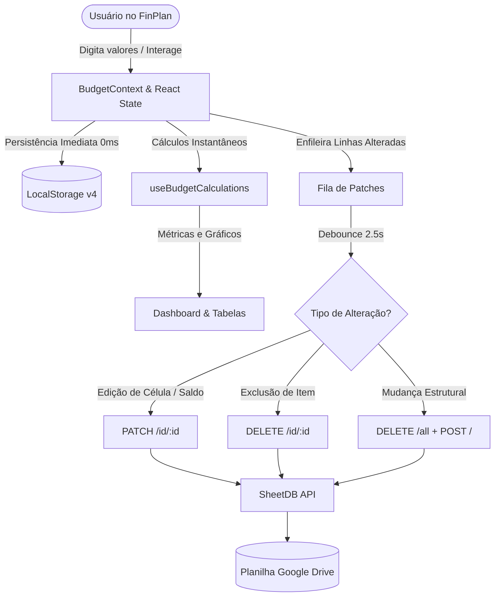

# 🏛️ FinPlan — Arquitetura do Sistema & Como Funciona

Este documento detalha o funcionamento interno, as decisões arquiteturais e o processo de construção do **FinPlan**, uma aplicação de planejamento financeiro pessoal de alta precisão que utiliza o **Google Sheets como banco de dados em nuvem (Database-in-the-Cloud)**.

---

## 📑 Sumário
1. [Visão Geral e Filosofia Arquitetural](#1-visão-geral-e-filosofia-arquitetural)
2. [Estrutura da Aplicação (Frontend)](#2-estrutura-da-aplicação-frontend)
3. [Modelo de Dados Relacional (Google Sheets)](#3-modelo-de-dados-relacional-google-sheets)
4. [Identificadores Semânticos Determinísticos (Por que não UUID?)](#4-identificadores-semânticos-determinísticos-por-que-não-uuid)
5. [Mecanismo de Sincronização Inteligente (Delta Sync & PATCH)](#5-mecanismo-de-sincronização-inteligente-delta-sync--patch)
6. [Resolução do Problema de Linhas Duplicadas](#6-resolução-do-problema-de-linhas-duplicadas)
7. [Suíte de Testes Automatizados](#7-suíte-de-testes-automatizados)
8. [Fluxos de Execução Passo a Passo](#8-fluxos-de-execução-passo-a-passo)
9. [Como Rodar e Desenvolver](#9-como-rodar-e-desenvolver)

---

## 1. Visão Geral e Filosofia Arquitetural

O FinPlan foi concebido para resolver três problemas fundamentais de aplicativos financeiros comuns:
1. **Horizontes temporais rígidos:** Aplicativos tradicionais prendem o usuário a um único mês ou a trimestres fixos. O FinPlan suporta de 1 a 60 meses com projeção contínua de caixa.
2. **Aprisionamento em bancos de dados proprietários:** Os dados pertencem ao usuário e ficam salvos em uma **Planilha Google**, acessível no seu Google Drive a qualquer momento.
3. **Arquitetura Local-First Reativa:** A interface responde instantaneamente (0ms de latência percebida) salvando localmente no `localStorage`, e sincroniza em segundo plano via API REST (SheetDB ou Google Apps Script).



---

## 2. Estrutura da Aplicação (Frontend)

O projeto foi construído em **React 18 + TypeScript + Vite + Tailwind CSS**:

```
Finances/
├── src/
│   ├── components/
│   │   ├── budget/             # Tabelas orçamentárias (Cartões, Fixas, Variáveis, Renda, Mudança)
│   │   ├── dashboard/          # Cards de KPIs, Gráficos SVG (Cashflow, Bar Chart, Donut)
│   │   ├── layout/             # Header com status de sync na nuvem e alternador de tema
│   │   ├── modals/             # Modais (Editar Saldo, Backup JSON, Transações, Metas)
│   │   ├── simulation/         # Simulador de cenários ("E se...")
│   │   └── ui/                 # Componentes reutilizáveis (CurrencyInput, Modal, HorizonSelector)
│   ├── constants/
│   │   ├── enums.ts            # Enums centralizados (Categorias, Status, Tipos de Linha, StorageKeys)
│   │   └── seedData.ts         # Estrutura base de inicialização
│   ├── context/
│   │   └── BudgetContext.tsx   # Estado global, gerenciamento de ciclo de vida e Delta Sync
│   ├── hooks/
│   │   └── useBudgetCalculations.ts # Motor matemático puro (fluxo de caixa, sobra, saldo acumulado)
│   ├── services/
│   │   ├── sheetService.ts     # Cliente HTTP (GET, PATCH, POST, DELETE) para Google Sheets
│   │   └── storageService.ts   # Persistência local segura com controle de versão
│   ├── utils/
│   │   ├── formatters.ts       # Formatação monetária BRL, parsing de datas e sequências de meses
│   │   └── idGenerator.ts      # Gerador de IDs semânticos determinísticos
│   └── __tests__/              # Suíte completa de testes unitários e de integração
```

---

## 3. Modelo de Dados Relacional (Google Sheets)

Na interface do usuário, o orçamento é exibido como uma **matriz bidimensional** (linhas são itens e colunas são meses). No entanto, bancos relacionais e APIs de planilhas operam de forma muito mais performática e auditável em **linhas normalizadas** (formato relacional):

| Coluna | Descrição | Exemplo |
| :--- | :--- | :--- |
| `id` | Chave primária única da linha | `despesa:cartoes:cartao_itau:2026-10` |
| `tipo` | Entidade do domínio (`config`, `renda`, `despesa`, `mudanca`, `meta`) | `despesa` |
| `categoria` | Agrupamento (`config`, `renda`, `cartoes`, `fixas`, `vars`, `mud`, `metas`) | `cartoes` |
| `nome` | Nome descritivo da conta ou configuração | `Cartão Itaú` |
| `mes_referencia` | Mês de competência (`YYYY-MM`) ou `geral` | `2026-10` |
| `valor` | Valor decimal numérico | `3300.50` |
| `status` | Estado de ativação (`ativo` ou `inativo`) | `ativo` |
| `observacao` | Metadados extras, ícones ou notas | `Fatura` |

---

## 4. Identificadores Semânticos Determinísticos (Por que não UUID?)

Cada registro na planilha possui um identificador **puro e determinístico**, gerado pelo utilitário `SheetIdGenerator`:

- **Configurações:** `cfg:saldo_inicial`, `cfg:reserva_emergencia`
- **Rendas:** `renda:<slug_do_nome>:<mes>` (ex: `renda:renda_liquida_mensal:2026-10`)
- **Despesas Recorrentes:** `despesa:<categoria>:<slug_do_nome>:<mes>` (ex: `despesa:cartoes:cartao_itau:2026-10`, `despesa:fixas:aluguel:2026-10`)
- **Custos Pontuais:** `mudanca:<slug_do_nome>` (ex: `mudanca:frete_ou_caminhao`)
- **Metas Financeiras:** `meta:<slug_do_nome>` (ex: `meta:reserva_de_emergencia`)

### Por que IDs Semânticos são superiores a UUIDs aleatórios neste sistema?
1. **Idempotência Matemática:** A função de geração de ID é pura: `f(categoria, nome, mes) = ID`. Se o app tentar salvar o mesmo mês de aluguel 10 vezes, ele **sempre gera a mesma chave**. Um UUID aleatório geraria 10 chaves diferentes, criando 10 linhas duplicadas.
2. **Legibilidade Humana:** Ao abrir a planilha no Google Sheets, qualquer pessoa ou fórmula de `PROCV` consegue entender a linha de relance sem decodificar strings opacas de 36 caracteres.
3. **Reconciliação Automática:** Se o usuário limpar o cache do navegador, o FinPlan lê a planilha do Google e reconstrói a matriz de meses perfeitamente sem precisar de tabelas intermediárias de mapeamento.

---

## 5. Mecanismo de Sincronização Inteligente (Delta Sync & PATCH)

Anteriormente, o sistema utilizava `POST` completo a cada edição, o que provocava inserção de novas linhas no final da planilha (duplicação contínua).

O novo mecanismo introduz **Delta Sync** com três camadas de operação:

### Camada 1: Atualização Cirúrgica In-Place (`PATCH`)
Quando o usuário altera o saldo, digita um valor de conta ou alterna o checkbox ativo/inativo:
1. O `BudgetContext` enfileira apenas o ID correspondente:
   ```ts
   recordPendingPatch('despesa:cartoes:cartao_itau:2026-10', { valor: 3500 });
   ```
2. Após 2,5 segundos sem novas edições (debounce), o sistema dispara em segundo plano:
   ```http
   PATCH /api/v1/{API_ID}/id/despesa%3Acartoes%3Acartao_itau%3A2026-10
   Content-Type: application/json

   { "data": { "valor": 3500 } }
   ```
3. A SheetDB localiza a linha pela coluna `id` e **atualiza a célula correspondente no mesmo lugar**.
4. Nenhuma linha é adicionada. Tempo de resposta: **~300ms**.

### Camada 2: Exclusão Cirúrgica (`DELETE`)
Quando um item é excluído no app:
```http
DELETE /api/v1/{API_ID}/id/despesa%3Acartoes%3Acartao_antigo%3A2026-10
```
A linha é removida da planilha sem deixar sobras.

### Camada 3: Sobrescrita Limpa Estrutural (`uploadToSheet`)
Se houver alteração estrutural profunda (como adicionar um novo horizonte de 24 meses ou clicar no botão manual **"Salvar na Planilha"**):
1. O FinPlan executa `DELETE /all`, que esvazia todas as linhas de dados da planilha **preservando intacta a linha 1 de cabeçalhos**.
2. Em seguida, executa `POST /` com a lista consolidada.
3. Isso garante com 100% de precisão matemática que **a planilha jamais acumulará registros fantasmas ou duplicados**.

---

## 6. Resolução do Problema de Linhas Duplicadas

### Causa Raiz
Na API da SheetDB, o endpoint `POST /api/v1/{API_ID}` opera **exclusivamente como APPEND**. O salvamento automático antigo enviava `POST` com todas as 86 linhas do estado a cada timer de debounce. Como resultado:
- A cada 3 segundos de edição, mais 86 linhas eram anexadas ao rodapé da planilha.
- O `cfg:saldo_inicial` passava a existir na linha 2, linha 88, linha 174, etc.

### Solução Aplicada
1. Criação do método [`sheetService.updateRow`](file:///c:/Users/gildo/Projects/Finances/src/services/sheetService.ts#L407) utilizando `PATCH /id/{id}`.
2. Criação do método [`sheetService.deleteRow`](file:///c:/Users/gildo/Projects/Finances/src/services/sheetService.ts#L503) utilizando `DELETE /id/{id}`.
3. Atualização do método [`sheetService.uploadToSheet`](file:///c:/Users/gildo/Projects/Finances/src/services/sheetService.ts#L560) com limpeza prévia (`DELETE /all`) em endpoints REST.
4. Fila reativa de deltas no [`BudgetContext.tsx`](file:///c:/Users/gildo/Projects/Finances/src/context/BudgetContext.tsx).
5. Limpeza de todas as 191 linhas duplicadas anteriores diretamente na SheetDB do usuário.

---

## 7. Suíte de Testes Automatizados

A estabilidade do serviço e dos geradores de ID é assegurada por **23 testes automatizados** com **Vitest**:

```bash
npm test
```

### Cobertura dos Testes:
1. **`idGenerator.test.ts` (11 testes):**
   - Normalização e remoção de acentuação (`Cartão Itaú` -> `cartao_itau`).
   - Remoção de caracteres especiais e espaços duplicados.
   - Geração de IDs semânticos para `config`, `renda`, `cartoes`, `fixas`, `vars`, `mudanca` e `meta`.
   - Extração de chave base para compatibilidade entre versões.

2. **`sheetService.test.ts` (12 testes):**
   - `exportStateToRows`: projeção correta de todo o estado em linhas relacionais.
   - `rowsToBudgetState`: reconstrução do estado e preenchimento de meses faltantes.
   - Deduplicação inteligente de linhas em caso de inconsistência externa.
   - `updateRow`: verificação da chamada `PATCH` com URL encoded e payload.
   - Fallback de inserção quando `PATCH` recebe 404 em novas linhas.
   - `insertRows`: inserção em lote sem duplicar existentes.
   - `deleteRow`: chamada cirúrgica `DELETE /id/{id}`.
   - `deleteDuplicates`: chamada de limpeza `/duplicates`.
   - `uploadToSheet`: ciclo de limpeza `DELETE /all` seguido de `POST` no SheetDB e envio de `mode: 'overwrite'` no Google Apps Script.

---

## 8. Fluxos de Execução Passo a Passo

### Cenário A: O Usuário Altera o Saldo Inicial
1. Usuário abre o modal **Ajustar Saldo** e digita `R$ 8.500,00`.
2. O formulário dispara `updateSimulation({ initialBalance: 8500 })`.
3. O `BudgetContext` atualiza o estado React instantaneamente e salva no `localStorage` (0ms).
4. O `BudgetContext` adiciona `['cfg:saldo_inicial', { valor: 8500 }]` à fila de patches.
5. Após 2,5s sem novas teclas, o temporizador dispara.
6. O `sheetService` faz `PATCH /api/v1/{API_ID}/id/cfg%3Asaldo_inicial` com `{ data: { valor: 8500 } }`.
7. A SheetDB altera o valor da linha 2 na planilha Google.
8. O Header exibe: *"Planilha sincronizada às 10:35"*.
9. Total de linhas na planilha: **inalterado**.

### Cenário B: O Usuário Edita a Fatura do Cartão de Outubro/2026
1. Usuário digita `3500` no input do Cartão Itaú em Out/26.
2. `updateItemValue('cartoes', itemId, '2026-10', 3500)` é acionado.
3. O ID semântico é resolvido: `despesa:cartoes:cartao_itau:2026-10`.
4. A fila de patches recebe `{ valor: 3500 }`.
5. O debounce envia `PATCH` para aquele ID.
6. A célula da fatura na planilha é atualizada in-place.

---

## 9. Como Rodar e Desenvolver

### Instalação
```bash
npm install
```

### Rodar Servidor Local
```bash
npm run dev
```

### Executar Testes
```bash
npm test
```

### Compilar para Produção
```bash
npm run build
```
O build gera um bundle leve e otimizado com TypeScript verificado rigorosamente em modo estrito.
