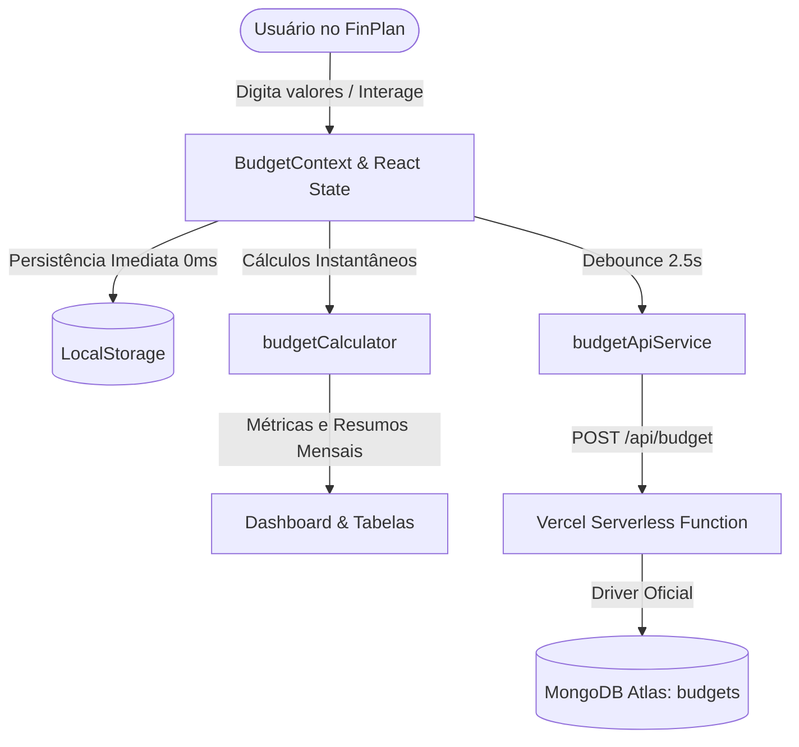

# 🏛️ FinPlan — Arquitetura do Sistema & Como Funciona

Este documento detalha o funcionamento interno, as decisões arquiteturais e o design do **FinPlan**, uma aplicação de planejamento financeiro pessoal de alta precisão baseada em uma arquitetura **Local-First com nuvem no MongoDB Atlas**.

---

## 📑 Sumário
1. [Visão Geral e Filosofia Arquitetural](#1-visão-geral-e-filosofia-arquitetural)
2. [Estrutura da Aplicação & Camadas](#2-estrutura-da-aplicação--camadas)
3. [Modelo de Domínio Limpo](#3-modelo-de-domínio-limpo)
4. [Estratégia de Identificadores (UUIDv4)](#4-estratégia-de-identificadores-uuidv4)
5. [Mecanismo de Persistência e Sincronização](#5-mecanismo-de-persistência-e-sincronização)
6. [Motor Matemático Puro (budgetCalculator)](#6-motor-matemático-puro-budgetcalculator)
7. [Suíte de Testes Automatizados](#7-suíte-de-testes-automatizados)
8. [Como Rodar e Desenvolver](#8-como-rodar-e-desenvolver)

---

## 1. Visão Geral e Filosofia Arquitetural

O FinPlan foi concebido para resolver três desafios fundamentais de aplicativos financeiros comuns:
1. **Horizontes temporais rígidos:** Permite projetar e navegar de 1 a 60 meses com projeção contínua de fluxo de caixa e cálculo dinâmico de reserva de emergência.
2. **Arquitetura Local-First Reativa:** A interface responde instantaneamente (0ms de latência percebida) persistindo o estado localmente no `localStorage`, e sincroniza em segundo plano com o **MongoDB Atlas** via API Serverless (`/api/budget`).
3. **Domínio Desacoplado e Puro:** O motor de cálculos matemáticos é uma função pura (`calculateBudget`), completamente isolada de renderização, efeitos de rede ou estado global.



---

## 2. Estrutura da Aplicação & Camadas

O projeto foi construído em **React 18 + TypeScript + Vite + Tailwind CSS** no frontend e **Node.js Serverless** para conexão com o MongoDB Atlas:

```
fin-plan/
├── api/
│   ├── lib/
│   │   └── mongodb.ts          # Pool de conexão singleton com MongoClient oficial
│   └── budget.ts               # Endpoint serverless GET / POST /api/budget
├── scripts/
│   └── migrate.js              # Script de migração de planilhas CSV para MongoDB
├── src/
│   ├── components/
│   │   ├── budget/             # Tabelas orçamentárias (Cartões, Fixas, Variáveis, Renda, Custos Pontuais)
│   │   ├── dashboard/          # Cards de KPIs e Gráficos SVG (Cashflow, Bar Chart)
│   │   ├── layout/             # Header com status de nuvem, Menu de Abas e StatusBar
│   │   ├── modals/             # Modais (Ajustar Saldo, Backup JSON, Transações, Metas)
│   │   ├── simulation/         # Simulador de cenários ("E se...")
│   │   └── ui/                 # Componentes reutilizáveis (CurrencyInput, Modal, Card, Button)
│   ├── constants/
│   │   ├── enums.ts            # Enums centralizados (Categorias, Status, Chaves de Storage)
│   │   ├── categories.ts       # Metadados visuais das categorias
│   │   └── seedData.ts         # Estrutura base de inicialização
│   ├── context/
│   │   ├── BudgetContext.tsx   # Estado global da aplicação e orquestração de nuvem
│   │   └── ToastContext.tsx    # Sistema de feedback visual com auto-dismiss e desfazer (Undo)
│   ├── hooks/
│   │   └── useBudgetCalculations.ts # Memoização reativa dos cálculos orçamentários
│   ├── services/
│   │   ├── budgetApiService.ts # Cliente HTTP para /api/budget com controle de timeout
│   │   ├── budgetCalculator.ts # Motor matemático puro (fluxo de caixa, sobra, saldo acumulado)
│   │   └── storageService.ts   # Persistência local segura, tema e migração de esquemas
│   ├── utils/
│   │   ├── formatters.ts       # Formatação monetária BRL, parsing de datas e sequências de meses
│   │   └── idGenerator.ts      # Gerador de identificadores únicos UUIDv4
│   └── __tests__/              # Suíte completa de testes automatizados com Vitest
```

---

## 3. Modelo de Domínio Limpo

O modelo de dados é fortemente tipado em TypeScript (`src/types/budget.ts`), separando de forma clara despesas recorrentes mensais de custos pontuais e metas de investimento:

```typescript
export interface BudgetState {
  version: number;
  months: MonthItem[];
  simulation: SimulationSettings;
  incomes: BudgetItem[];
  lists: {
    cartoes: BudgetItem[];
    fixas: BudgetItem[];
    vars: BudgetItem[];
  };
  oneTimeCosts: OneTimeCost[];
  goals: FinancialGoal[];
}
```

### Entidades do Domínio:
- **`MonthItem`**: Mês de competência (`id: '2026-10'`, `name: 'Outubro 2026'`, `year`, `monthIndex`).
- **`BudgetItem`**: Receitas ou despesas recorrentes mensais. Mapeia valores por mês através de um dicionário (`values: Record<string, number>`).
- **`OneTimeCost`**: Custos únicos de projetos ou eventos (reformas, viagens, mudanças), desacoplados de listas mensais recorrentes e associados opcionalmente a um mês de desembolso (`targetMonthId`).
- **`FinancialGoal`**: Metas de investimento com histórico de aportes (`contributions`) e status de conclusão.
- **`SimulationSettings`**: Parâmetros globais de simulação de sensibilidade (ex: estresse de despesas variáveis, margem de segurança de custos pontuais, reserva de emergência).

---

## 4. Estratégia de Identificadores (UUIDv4)

Com a arquitetura moderna baseada em documentos no MongoDB Atlas:
- Todos os identificadores de entidades (`BudgetItem`, `OneTimeCost`, `FinancialGoal`, `GoalContribution`) são gerados como **UUIDs padrão (v4)** via utilitário `generateId()`.
- O utilitário utiliza nativamente a Web Crypto API (`crypto.randomUUID()`) com fallback estocástico em ambientes legados.
- Elimina-se acoplamento a slugs semânticos artificiais, garantindo unicidade absoluta e simplicidade estrutural.

---

## 5. Mecanismo de Persistência e Sincronização

A sincronização de dados funciona com arquitetura híbrida de alta disponibilidade:

1. **Camada 1 — LocalStorage (0ms de latência):**
   - A cada alteração no estado React, os dados são imediatamente serializados e armazenados no navegador (`StorageKey.AppData`).
   - Garante funcionamento 100% offline e tolerância a quedas de rede.
2. **Camada 2 — Auto-Save com Debounce (MongoDB Atlas):**
   - Alterações contínuas disparam um timer de debounce de 2,5 segundos.
   - O estado consolidado é salvo atomicamente no documento `default_budget` no MongoDB Atlas.
3. **Camada 3 — Reconexão Automática:**
   - Detecta eventos de `online`/`offline` do navegador, sincronizando imediatamente pendências assim que a conexão for reestabelecida.

---

## 6. Motor Matemático Puro (`budgetCalculator`)

O arquivo [`budgetCalculator.ts`](file:///home/gildo-duarte/Documentos/Projects/fin-plan/src/services/budgetCalculator.ts) centraliza toda a lógica de inteligência financeira:
- **Cálculo de Fluxo de Caixa**: Soma receitas, despesas fixas, variáveis, faturas de cartão e custos pontuais do mês.
- **Multiplicadores de Simulação**: Aplica fatores de simulação em tempo real (`varsPercent`, `rendaPercent`, `oneTimeMarginPercent`) sem corromper os valores base digitados.
- **Saldo Acumulado Contínuo**: Projeta a evolução do saldo mês a mês acumulando a sobra ou déficit de cada competência sobre o saldo inicial em conta.
- **Disponibilidade Real**: Subtrai a reserva de emergência do saldo acumulado para indicar o caixa livre para aportes ou projetos.

---

## 7. Suíte de Testes Automatizados

A estabilidade do sistema é garantida por testes unitários com **Vitest**:

```bash
npm test
```

### Arquivos de Teste:
1. **`budgetCalculator.test.ts`**:
   - Validação dos cálculos mensais de receita, custos e sobras.
   - Aplicação dos multiplicadores de simulação.
   - Exclusão de itens desativados (`off: true`).
   - Cálculo de métricas consolidadas (mínimo saldo, taxa de poupança média, impacto de custos pontuais).
2. **`budgetApiService.test.ts`**:
   - Respostas de sucesso e erro ao carregar/salvar orçamento na API do MongoDB.
   - Tratamento de timeout e exceções de rede.
3. **`storageService.test.ts`**:
   - Persistência e recuperação no `localStorage`.
   - Normalização e migração de esquemas com preenchimento de campos ausentes.
   - Persistência do tema visual (dark/light) e validação de importação JSON.
4. **`idGenerator.test.ts`**:
   - Conformidade com o formato UUIDv4.
   - Unicidade de IDs e funcionamento de fallback.

---

## 8. Como Rodar e Desenvolver

### Instalar Dependências
```bash
npm install
```

### Executar em Desenvolvimento
```bash
npm run dev
```

### Rodar Testes Unitários
```bash
npm test
```

### Compilar para Produção (Typecheck Estrito + Bundling)
```bash
npm run build
```
