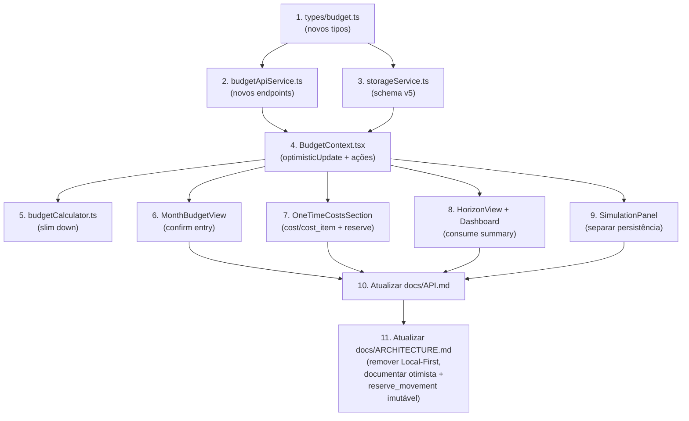

# FinPlan Frontend Migration — Plano Fiel ao Schema PostgreSQL

## Schema SQL → Tipos TypeScript

Mapeamento exato de cada tabela SQL para o tipo frontend correspondente.

### `budget` → `Budget`
```sql
CREATE TABLE budget (
  id                        TEXT PRIMARY KEY,        -- ex: '2026'
  year                      INT NOT NULL UNIQUE,
  initial_balance           NUMERIC(12,2) NOT NULL DEFAULT 0,
  emergency_reserve_target  NUMERIC(12,2) NOT NULL DEFAULT 0,
  created_at                TIMESTAMPTZ,
  updated_at                TIMESTAMPTZ
);
```
```typescript
interface Budget {
  id: string;               // '2026'
  year: number;
  initialBalance: number;
  emergencyReserveTarget: number;
  createdAt?: string;
  updatedAt?: string;
}
```
> [!IMPORTANT]
> **`simulation` (varsPercent, rendaPercent, oneTimeMarginPercent) NÃO existe no PostgreSQL.**
> Esses valores ficam apenas no `localStorage` do frontend para o Simulador de Cenários.
> Apenas `initialBalance` e `emergencyReserveTarget` são persistidos na tabela `budget`.
> `localStorage` é usado SOMENTE para esses percentuais de simulação e preferências de
> UI (tema, ano selecionado) — ver seção "Persistência: 100% backend" abaixo para o
> restante dos dados.

### Meses — NÃO viram tabela
```
-- "months" não vira tabela: nome/mês/shortName são deriváveis de (ano, monthIndex).
```
O frontend continua gerando `MonthItem` localmente via `createMonthItem(year, monthIndex)`, mas **não os persiste no backend**. O backend usa `month: INT` (1–12).

### `item` → `Item`
```sql
CREATE TABLE item (
  id          UUID PRIMARY KEY,
  budget_id   TEXT NOT NULL REFERENCES budget(id),
  name        TEXT NOT NULL,
  type        TEXT NOT NULL CHECK (type IN ('renda','fixa','variavel','cartao')),
  created_at  TIMESTAMPTZ
);
```
```typescript
interface Item {
  id: string;
  budgetId: string;
  name: string;
  type: 'renda' | 'fixa' | 'variavel' | 'cartao';  // NÃO 'var', é 'variavel'
  createdAt?: string;
  entries?: Entry[];  // populado no GET quando necessário
}
```

### `entry` → `Entry`
```sql
CREATE TABLE entry (
  id              UUID PRIMARY KEY,
  item_id         UUID NOT NULL REFERENCES item(id),
  month           INT NOT NULL CHECK (month BETWEEN 1 AND 12),
  planned_amount  NUMERIC(12,2) NOT NULL DEFAULT 0,
  actual_amount   NUMERIC(12,2),           -- null = ainda não confirmado
  due_date        DATE,
  paid_date       DATE,                     -- preenchido = "confirmado"
  UNIQUE (item_id, month)
);
```
```typescript
interface Entry {
  id: string;
  itemId: string;
  month: number;               // 1–12 (INT, não monthId string)
  plannedAmount: number;
  actualAmount: number | null;  // null = não confirmado
  dueDate: string | null;       // ISO date
  paidDate: string | null;      // preenchido = confirmado (sem coluna status)
}
```

### `cost` → `Cost`
```sql
CREATE TABLE cost (
  id               UUID PRIMARY KEY,
  budget_id        TEXT NOT NULL REFERENCES budget(id),
  name             TEXT NOT NULL,
  default_month    INT CHECK (default_month BETWEEN 1 AND 12), -- NULL = sem mês fixo
  margin_percent   NUMERIC(5,2) NOT NULL DEFAULT 0,
  notes            TEXT
);
```
```typescript
interface Cost {
  id: string;
  budgetId: string;
  name: string;
  defaultMonth: number | null;   // null = "sem mês fixo, deduz no saldo final"
  marginPercent: number;          // "Margem de Imprevistos" vive AQUI, não na simulation
  notes?: string;
  items?: CostItem[];            // populado no GET
  totalPlanned?: number;         // calculado no backend — ver seção "Cálculo de margem"
  totalWithMargin?: number;      // calculado no backend — ver seção "Cálculo de margem"
}
```

### `cost_item` → `CostItem`
```sql
CREATE TABLE cost_item (
  id               UUID PRIMARY KEY,
  cost_id          UUID NOT NULL REFERENCES cost(id),
  name             TEXT NOT NULL,
  planned_amount   NUMERIC(12,2) NOT NULL,
  actual_amount    NUMERIC(12,2),
  month            INT CHECK (month BETWEEN 1 AND 12), -- NULL = herda cost.default_month
  due_date         DATE,
  paid_date        DATE
);
```
```typescript
interface CostItem {
  id: string;
  costId: string;
  name: string;
  plannedAmount: number;
  actualAmount: number | null;
  month: number | null;          // null = herda cost.defaultMonth; ambos null = saldo final
  dueDate: string | null;
  paidDate: string | null;
}
```

### `goal` → `FinancialGoal` (mantém nome)
```typescript
interface FinancialGoal {
  id: string;
  name: string;
  description?: string;
  targetAmount: number;
  icon?: string;
  color?: string;
  status: 'ativa' | 'concluida' | 'pausada';
  contributions: GoalContribution[];  // populado no GET
}
```

### `goal_contribution` → `GoalContribution` (sem mudança)
```typescript
interface GoalContribution {
  id: string;
  goalId: string;
  date: string;
  amount: number;
  note?: string;
}
```

### `reserve_movement` → `ReserveMovement` (novo — livro-razão imutável)
```typescript
interface ReserveMovement {
  id: string;
  budgetId: string;
  month: number;       // 1–12
  amount: number;      // positivo = aporte, negativo = retirada
  reason?: string;
}
```
> [!NOTE]
> **Imutável por design.** Só existe `Create` e `List` — nenhum `Update`/`Delete`.
> Movimentação de reserva é histórico; corrigir um lançamento errado é um novo
> `ReserveMovement` de sinal oposto, não uma edição do original. Documentar essa
> decisão em `docs/ARCHITECTURE.md` para não ser "corrigida" por engano numa PR futura.

### `BudgetSummary` (novo — resposta de `GET /budgets/{year}/summary`)
```typescript
interface BudgetSummaryMonth {
  month: number;                 // 1–12
  income: number;
  cards: number;
  fixed: number;
  variable: number;
  oneTimeCosts: number;
  totalExpenses: number;
  monthBalance: number;
  accumulatedBalance: number;
}

interface BudgetSummary {
  year: number;
  initialBalance: number;
  emergencyReserveTarget: number;
  months: BudgetSummaryMonth[];
  totals: {
    income: number;
    cards: number;
    fixed: number;
    variable: number;
    oneTimeCosts: number;
    totalExpenses: number;
    netBalance: number;
    finalAccumulated: number;
  };
}
```

---

## Endpoints de API — `budgetApiService.ts`

### Budget
| Ação | Método | Endpoint | Body/Response |
|------|--------|----------|---------------|
| Listar anos | GET | `/api/v1/budgets` | `Budget[]` |
| Carregar ano | GET | `/api/v1/budgets/{year}` | `{ budget, items, costs, goals }` |
| Criar ano | POST | `/api/v1/budgets` | `{ year, initialBalance?, emergencyReserveTarget? }` |
| Atualizar budget | PATCH | `/api/v1/budgets/{year}` | `{ initialBalance?, emergencyReserveTarget? }` |
| Summary | GET | `/api/v1/budgets/{year}/summary` | `BudgetSummary` |

### Items & Entries
| Ação | Método | Endpoint | Body/Response |
|------|--------|----------|---------------|
| Criar item | POST | `/api/v1/items` | `{ budgetId, name, type }` → backend gera 12 entries |
| Atualizar item | PATCH | `/api/v1/items/{id}` | `{ name? }` |
| Deletar item | DELETE | `/api/v1/items/{id}` | cascata apaga entries |
| Atualizar entry (planejado) | PATCH | `/api/v1/entries/{id}` | `{ plannedAmount }` |
| Confirmar entry (realizado) | PATCH | `/api/v1/entries/{id}` | `{ actualAmount, paidDate }` |

> [!IMPORTANT]
> **PATCH precisa ser parcial de verdade.** O mesmo endpoint é usado tanto para
> editar `plannedAmount` quanto para confirmar `actualAmount`/`paidDate`, com
> bodies diferentes. O backend deve atualizar SOMENTE os campos presentes no
> body (usar ponteiros/`*T` no Go para distinguir "campo ausente" de "campo
> zerado") — nunca sobrescrever um campo que não veio no request. O frontend
> deve enviar sempre o body mínimo (só os campos que de fato mudaram), nunca o
> objeto completo da entry/cost_item.

### Costs & CostItems
| Ação | Método | Endpoint | Body/Response |
|------|--------|----------|---------------|
| Criar cost | POST | `/api/v1/costs` | `{ budgetId, name, defaultMonth?, marginPercent? }` |
| Detalhar cost | GET | `/api/v1/costs/{id}` | `Cost` com `items[]`, `totalPlanned`, `totalWithMargin` |
| Atualizar cost | PATCH | `/api/v1/costs/{id}` | `{ name?, defaultMonth?, marginPercent?, notes? }` |
| Deletar cost | DELETE | `/api/v1/costs/{id}` | cascata apaga cost_items |
| Criar cost_item | POST | `/api/v1/costs/{costId}/items` | `{ name, plannedAmount, month? }` |
| Atualizar cost_item | PATCH | `/api/v1/costs/{costId}/items/{id}` | `{ name?, plannedAmount?, month?, actualAmount?, paidDate? }` |
| Deletar cost_item | DELETE | `/api/v1/costs/{costId}/items/{id}` | |

> [!IMPORTANT]
> **Cálculo de margem: sempre no backend, nunca no frontend.**
> `totalPlanned` (soma de `cost_item.plannedAmount`) e `totalWithMargin`
> (`totalPlanned * (1 + marginPercent/100)`) são calculados por
> `GET /api/v1/costs/{id}`. O frontend só exibe esses dois campos, nunca
> recalcula — evita duplicar a fórmula em dois lugares e divergir se
> `marginPercent` mudar.

### Goals & Contributions (mantém)
| Ação | Método | Endpoint |
|------|--------|----------|
| CRUD goal | POST/PATCH/DELETE | `/api/v1/goals`, `/api/v1/goals/{id}` |
| Contribuição | POST/DELETE | `/api/v1/goals/{id}/contributions` |

### Reserve Movements (novo — somente criação e leitura)
| Ação | Método | Endpoint |
|------|--------|----------|
| Criar | POST | `/api/v1/reserve-movements` |
| Listar por budget | GET | `/api/v1/budgets/{year}/reserve-movements` |

---

## Persistência: 100% backend, sem cache local de dados

Decisão confirmada: `items`, `entries`, `costs`, `costItems`, `goals` e
`reserveMovements` NÃO ficam mais no `localStorage` — toda leitura vem do
backend (`GET /budgets/{year}`), e cada escrita é uma chamada atômica
(`PATCH`/`POST`/`DELETE`) por recurso. Isso substitui o modelo Local-First
anterior (documento único espelhado localmente) — atualizar
`docs/ARCHITECTURE.md` removendo a seção "Local-First vs. Server-First" do
estado antigo.

Sem cache local, a responsividade da UI depende de **atualização otimista**:

1. Ao editar (ex: `plannedAmount`, confirmar `entry`, criar `costItem`), o
   `BudgetContext` atualiza o React state IMEDIATAMENTE, antes da resposta
   do backend — mantém a sensação de 0ms de latência que o projeto já tinha.
2. O `PATCH`/`POST`/`DELETE` correspondente é disparado em paralelo.
3. Se a chamada falhar (erro de rede, `4xx`, `5xx`), reverter o state pro
   valor anterior (guardar o valor pré-edição antes de aplicar o otimista) e
   notificar o usuário via `ToastContext` (o componente de toast já existe
   no projeto, reaproveitar).
4. Se a chamada tiver sucesso, nenhuma ação adicional — o state otimista já
   é o state final (não precisa re-buscar do backend).

Implementar isso como um helper genérico em `BudgetContext.tsx` (ex:
`optimisticUpdate(localUpdateFn, apiCallFn, rollbackFn)`), reutilizado por
todas as ações (`updatePlannedAmount`, `confirmEntry`, `addCostItem`, etc.)
em vez de duplicar a lógica de try/catch/rollback em cada ação.

`localStorage` continua existindo, mas restrito a: percentuais de simulação
(`varsPercent`, `rendaPercent`, `oneTimeMarginPercent`) e preferências de UI
(tema, ano selecionado) — ver schema v5 abaixo.

---

## Mudanças no `BudgetContext.tsx`

### Estado: de `values[monthId]` para `Entry[]`
```
ANTES:  item.values["2026-10"] = 8500
DEPOIS: entry { itemId, month: 10, plannedAmount: 8500, actualAmount: null }
```

### Ações novas (todas via `optimisticUpdate`, ver seção anterior)
- `confirmEntry(entryId, actualAmount)` → PATCH `/api/v1/entries/{id}` com `{ actualAmount, paidDate: hoje }`
- `unconfirmEntry(entryId)` → PATCH com `{ actualAmount: null, paidDate: null }`
- `updatePlannedAmount(entryId, value)` → PATCH com `{ plannedAmount: value }` (debounce 400ms)
- `createCost(name, defaultMonth?)` → POST `/api/v1/costs`
- `addCostItem(costId, name, plannedAmount, month?)` → POST `/api/v1/costs/{costId}/items`
- `updateCostItem(costId, itemId, patch)` → PATCH `/api/v1/costs/{costId}/items/{id}`
- `removeCostItem(costId, itemId)` → DELETE
- `createReserveMovement(month, amount, reason?)` → POST `/api/v1/reserve-movements` (sem `update`/`delete` — ver seção `ReserveMovement`)

### Simulation Settings
- `varsPercent`, `rendaPercent`, `oneTimeMarginPercent` ficam APENAS em `localStorage`
- `initialBalance` e `emergencyReserveTarget` persistem via `PATCH /api/v1/budgets/{year}`
- `updateSimulation()` separa: atualiza `localStorage` + chama PATCH se for balance/reserve

### Summary
- `monthlySummaries` e `metrics` vêm de `GET /api/v1/budgets/{year}/summary`, não do `budgetCalculator.ts`
- `budgetCalculator.ts` mantém APENAS os cálculos de simulação "E se..." (client-side em cima do summary)

---

## Mudanças por Componente

### Tela: Mês Atual (`MonthBudgetView.tsx`)
- Cada linha de entry: **campo editável** = `plannedAmount` + **botão ✓** = confirmar `actualAmount`/`paidDate`
- Quando confirmado: linha mostra ícone verde ✓ e valor realizado ao lado do planejado
- "+ Novo Item" → `POST /api/v1/items` (backend gera 12 entries)
- Cards de topo ("Renda Prevista", "Total Despesas", "Sobra do Mês") vêm do `summary`
- "Saldo acumulado em conta até [mês]" vem do `summary`

### Tela: 12 Meses & Gráficos (`HorizonView.tsx`)
- `MonthlySummaryTable` consome `BudgetSummary.months[]` direto
- `CashFlowChart` e `MonthlyBarChart` usam dados do summary
- "Baixar planilha (CSV)" exporta dados do summary

### Tela: Metas & Reserva (`GoalsSection.tsx` + `OneTimeCostsSection.tsx`)
- `GoalsSection` → sem mudança estrutural (goals/contributions mantêm API similar)
- `OneTimeCostsSection` → reestruturação profunda:
  - "Custos Pontuais" vira lista de **projetos** (`Cost`)
  - Cada `Cost` é expansível, mostra tabela de `CostItem[]`
  - "Agendamento Global" → `cost.defaultMonth` (dropdown nullable)
  - Cada `cost_item` pode sobrescrever o mês (dropdown individual)
  - "Custo Total" e "Com Margem" vêm de `GET /api/v1/costs/{id}` (`totalPlanned`/`totalWithMargin`) — nunca recalculados no frontend
  - `margin_percent` vive no `cost`, não na simulation
- Nova subseção de reserva: ação de registrar `ReserveMovement` (aporte/retirada manual), listando o histórico via `GET /budgets/{year}/reserve-movements` — sem opção de editar/apagar um lançamento (ver nota de imutabilidade)

### Tela: Simulações (`SimulationPanel.tsx`)
- Sem mudança de arquitetura
- Sliders continuam sendo cálculo client-side
- Valores-base ("Despesas Variáveis (Média/mês)", "Custos Pontuais Totais") vêm da agregação de `entry`/`cost_item` carregados via `GET /api/v1/budgets/{year}`
- `initialBalance` e `emergencyReserveTarget` → lidos/salvos via PATCH no `budget`
- `varsPercent`, `oneTimeMarginPercent` → localStorage apenas

---

## storageService.ts — Schema v5

```typescript
const STORAGE_KEY = 'finplan-app-data-v5';

interface LocalSettings {
  version: 5;
  currentYear: number;
  simulation: {
    varsPercent: number;
    rendaPercent: number;
    oneTimeMarginPercent: number;
  };
  theme: 'light' | 'dark';
}
```

Migração v4→v5:
- Move `initialBalance`/`emergencyReserve` de `simulation` para `budget` no backend
- Mantém apenas percentuais de simulação no localStorage
- Remove dados de items/costs/goals do localStorage (agora 100% backend)

---

## Ordem de Implementação



---

## Validação obrigatória
- Cada uma das telas deve continuar visualmente idêntica ao estado atual —
  só a fonte de dados e as interações de "confirmar" mudam.
- Testar o fluxo completo manualmente: criar item → ver 12 entries geradas →
  confirmar uma entry → ver refletido no summary/gráfico → criar custo
  pontual com "sem mês fixo" → criar 2 itens dentro, um com mês próprio → ver
  refletido no total, na margem e no saldo do mês correto.
- Testar explicitamente o caminho de falha: simular erro (rede desligada ou
  `500` forçado) ao editar um valor e confirmar que a UI reverte para o valor
  anterior e mostra o toast de erro — não só o caminho feliz.
- Testar que um `PATCH` de "confirmar entry" (`actualAmount`/`paidDate`) não
  altera o `plannedAmount` já salvo, e vice-versa.
- Confirmar que `docs/API.md` e `docs/ARCHITECTURE.md` foram atualizados ao
  final (passos 10 e 11 do diagrama acima), não deixados para depois.
