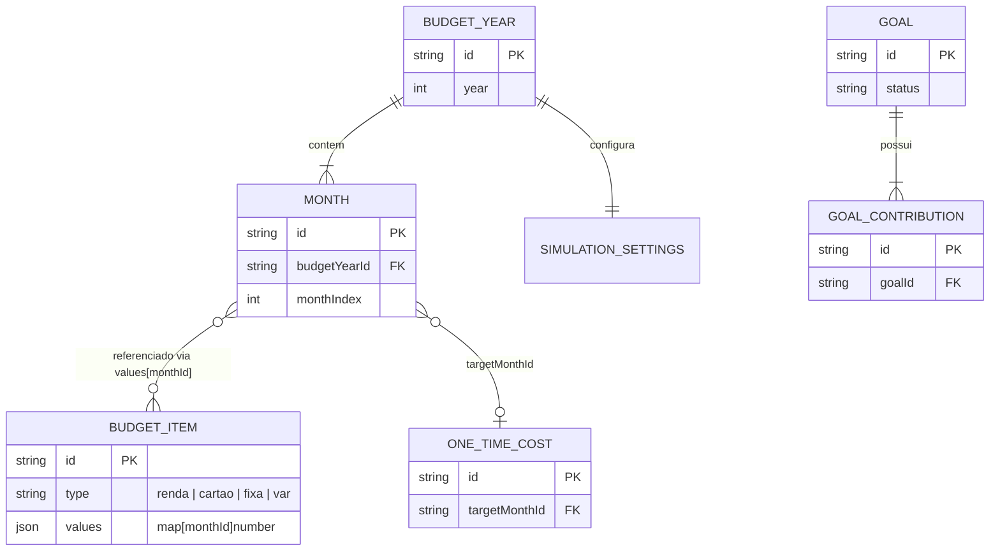

# TAREFA: Remodelar o domínio do FinPlan (agregado por ano + edição atômica) e revisar o frontend

O modelo de dados atual (`BudgetState` como documento único no MongoDB,
definido em `apps/api/internal/budget/model.go` e espelhado em
`src/types/budget.ts` no frontend) está excessivamente acoplado: qualquer
edição de um único item exige reescrever o orçamento inteiro, e não existe o
conceito de "ano" como unidade — `months` é uma lista solta sem fronteira
temporal.

Esta tarefa reestrutura o domínio em entidades separadas, com edição atômica
por item, mantendo a mesma stack (Go no backend, MongoDB, React/TypeScript no
frontend). Isso toca backend, banco de dados E frontend — trate como uma
mudança coordenada, não três tarefas isoladas.

**Decisão assumida (confirme com o usuário antes de implementar se tiver
qualquer dúvida)**: `SimulationSettings` passa a ter escopo por ano
(`BudgetYear`), não mais global — premissas de sensibilidade tendem a mudar
ano a ano.

---

## 1. Novo modelo de domínio

```
BudgetYear
  id            string   ex: "2026"
  year          int
  simulation    SimulationSettings   (escopo por ano)
  createdAt / updatedAt

Month
  id            string   ex: "2026-10"
  budgetYearId  string   FK -> BudgetYear
  name, shortName, monthIndex

BudgetItem   (substitui Income + ExpenseLists.cartoes/fixas/vars)
  id            string   UUIDv4
  type          "renda" | "cartao" | "fixa" | "var"
  name
  values        map[monthId]float64
  off, notes, dueDate
  # NÃO tem budgetYearId — um item pode ter values em vários anos
  #  (ex: "Salário" cobrindo 2026 e 2027). Prender a um ano quebraria
  #  a edição atômica (teria que duplicar o item por ano).

OneTimeCost
  id            string
  name, value, targetMonthId, off, notes

Goal
  id            string
  name, description, targetAmount, icon, color, status
  contributions []GoalContribution   # continua embutido no Goal,
                                       # não vira collection própria
                                       # (volume pequeno, sempre editado
                                       # no contexto do goal, $push já
                                       # é atômico)
```

### Por que `type` substitui `cartoes`/`fixas`/`vars` como listas fixas
Hoje adicionar uma 4ª categoria de despesa exige mudar o schema
(`ExpenseLists`). Com `type` como string, adicionar categoria é só inserir
dado — nenhuma migração de schema necessária no futuro.

### Diagrama de relacionamento



---

## 2. Persistência (MongoDB)

Um documento Mongo por entidade (não mais um documento único pra tudo). Isso
resolve dois problemas de uma vez, sem precisar de transação multi-documento
(update de um documento no Mongo já é atômico por natureza):
- **Edição atômica**: alterar um item só toca o documento daquele item.
- **Concorrência**: o problema de last-write-wins deixa de afetar o
  orçamento inteiro e passa a afetar só o item tocado.

Collections sugeridas:
```
budget_years   { _id, year, simulation, createdAt, updatedAt }
months         { _id, budgetYearId, name, shortName, monthIndex }
budget_items   { _id, type, name, values, off, notes, dueDate }
one_time_costs { _id, name, value, targetMonthId, off, notes }
goals          { _id, name, description, targetAmount, icon, color, status, contributions }
```
Índices necessários: `months.budgetYearId`, `one_time_costs.targetMonthId`.

---

## 3. Nova superfície de API

Seguir a arquitetura já estabelecida em `apps/api` (handler → service →
repository, um pacote por entidade em `internal/`). Cada entidade nova segue
o mesmo padrão de `internal/budget/`.

```
# Escrita — atômica, um recurso por vez
POST   /api/v1/budget-items          # cria income/expense (type no body)
PATCH  /api/v1/budget-items/{id}     # edita um item específico
DELETE /api/v1/budget-items/{id}

POST   /api/v1/one-time-costs
PATCH  /api/v1/one-time-costs/{id}
DELETE /api/v1/one-time-costs/{id}

POST   /api/v1/goals
PATCH  /api/v1/goals/{id}
DELETE /api/v1/goals/{id}
POST   /api/v1/goals/{id}/contributions

POST   /api/v1/budget-years              # cria um novo ano
PATCH  /api/v1/budget-years/{year}        # edita simulation settings do ano
POST   /api/v1/budget-years/{year}/months # adiciona mês a um ano

# Leitura — agregada, otimizada pra renderizar a tela (join server-side)
GET    /api/v1/budget-years/{year}        # monta o view model completo daquele ano
```

O `GET /budget-years/{year}` deve retornar um payload agregado (meses +
items com values filtrados/relevantes + one-time costs + goals), para o
frontend não precisar fazer N chamadas pra montar a tela inicial. As
edições, porém, são sempre pontuais (PATCH/POST/DELETE por recurso).

---

## 4. Migração dos dados existentes

Escrever um script de migração (roda uma vez, lê o documento único
`default_budget` atual e popula as novas collections):

1. Agrupar `months` por `year` → criar um `BudgetYear` por ano distinto +
   os `Month` correspondentes.
2. `simulation` atual (hoje global) vira o valor inicial replicado em cada
   `BudgetYear` criado.
3. Cada item de `incomes` vira `BudgetItem{type: "renda"}`; cada item de
   `lists.cartoes/fixas/vars` vira `BudgetItem{type: "cartao"|"fixa"|"var"}`
   — mantendo o mesmo `id` (não regenerar UUID).
4. `oneTimeCosts` e `goals` (com `contributions` embutidas) migram 1:1 para
   as novas collections, mantendo os `id`s.
5. O documento antigo (`default_budget`) NÃO deve ser apagado nesta tarefa —
   fica como fallback/histórico até a migração ser validada em produção.
6. O script deve ser idempotente (pode rodar mais de uma vez sem duplicar
   dados) e logar um resumo do que foi migrado (quantos anos, items, goals).

---

## 5. Revisão obrigatória do frontend

O frontend (`src/`) foi construído inteiramente em torno do `BudgetState`
como blob único (`BudgetContext.tsx`, `budgetCalculator.ts`,
`budgetApiService.ts`, `storageService.ts` com a chave
`finplan-app-data-v4`). Essa mudança de domínio exige revisão de ponta a
ponta do frontend, não só troca de endpoint. Trate como uma sub-tarefa
própria, executada DEPOIS que a API nova estiver validada:

1. **`src/types/budget.ts`**: atualizar os tipos para refletir o novo
   modelo (`BudgetItem.type` em vez de `lists.cartoes/fixas/vars`,
   `BudgetYear` como entidade).
2. **`src/services/budgetApiService.ts`**: trocar as chamadas de
   `GET/POST /api/budget` (blob único) pelos novos endpoints atômicos —
   cada ação do usuário (editar um item, adicionar uma contribuição) deve
   disparar um `PATCH`/`POST` pontual, não mais o envio do estado completo.
3. **`src/context/BudgetContext.tsx`**: o modelo de debounce de 500ms
   fazia sentido para "juntar edições e mandar o blob inteiro". Com
   endpoints atômicos, avaliar se o debounce ainda é necessário por campo
   individual (ex: enquanto o usuário digita um valor) ou se cada edição
   discreta (blur, seleção, submit de modal) já dispara direto — decidir
   isso explicitamente, não herdar o padrão antigo sem revisão.
4. **`src/services/budgetCalculator.ts`**: os cálculos hoje operam sobre
   `BudgetState` completo; revisar se precisam ser adaptados para operar
   sobre a resposta agregada de `GET /budget-years/{year}` (que deve ter
   formato equivalente para minimizar a mudança aqui).
5. **`src/services/storageService.ts`**: o cache local
   (`finplan-app-data-v4`) precisa de nova versão de schema (`v5`) com
   migração automática do formato antigo, seguindo o padrão já usado na
   migração v3→v4.
6. **Componentes que assumem `lists.cartoes/fixas/vars`** (provavelmente em
   `src/components/budget/`): atualizar para filtrar `BudgetItem[]` por
   `type` em vez de acessar chaves fixas.
7. **Seletor de ano/mês** (`src/components/months/`): revisar para lidar
   com `BudgetYear` como unidade real, não apenas uma lista de meses solta.

Ao final da revisão do frontend, `docs/API.md` e `docs/ARCHITECTURE.md`
(incluindo o diagrama ER) devem ser atualizados para refletir o novo
domínio — a versão atual desses documentos descreve o modelo antigo.

---

## 6. Ordem de execução recomendada

1. Novo modelo de domínio + collections no backend (`apps/api`).
2. Novos endpoints atômicos, mantendo os endpoints antigos
   (`GET/POST /api/v1/budget`, se ainda existirem no Go, ou
   `api/budget.ts`) funcionando em paralelo até o frontend ser migrado —
   não quebrar produção no meio do caminho.
3. Script de migração de dados, testado contra uma cópia dos dados reais.
4. Revisão do frontend (seção 5), consumindo os novos endpoints.
5. Validação ponta a ponta (testes + uso manual).
6. Só então: descontinuar os endpoints antigos e o formato de blob único.

## 7. Validação obrigatória contra o código atual
- Todo tipo/campo novo deve ser conferido contra o `model.go` atual antes de
  remover ou renomear algo — não perder nenhum campo existente na migração
  (ex: `Notes`, `DueDate`, `Icon`, `Color` em `FinancialGoal`).
- Rodar a migração contra uma cópia dos dados reais do MongoDB Atlas de dev
  e validar manualmente que nada foi perdido.
- Ao final, atualizar `docs/API.md`, `docs/ARCHITECTURE.md` e o `README.md`
  (árvore de pastas, se novas entidades gerarem novos arquivos/pacotes) e
  gerar um changelog explícito do que mudou, incluindo o que ficou pendente
  (ex: descontinuar endpoints antigos).
